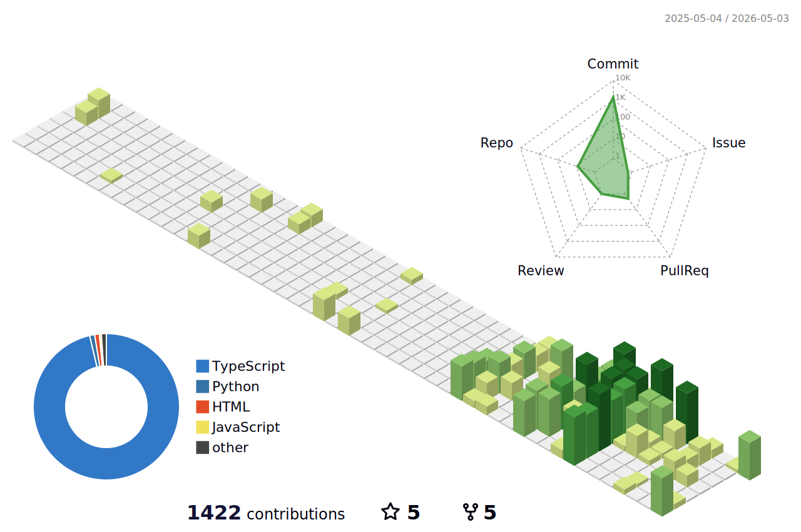

<!-- Profile Header -->

<h1 align="center">Hi 👋, I'm Aakash Priyadarshi</h1>
<h3 align="center">A passionate full stack developer from India </h3>

  

<!-- Badges in one line -->

  
  
  
  
  

<!-- 3D Contribution Calendar -->
<h2 align="center">🔥 My Contribution Calendar</h2>

  

  

## 💫 About Me

- 🔭 I'm currently working on **Neural Network based projects**
- 🌱 I'm currently learning **AI, DL and NN**
- 👯 I'm looking to collaborate on **any MERN stack or NN based projects**
- 🤝 I'm looking for help with **Neural Network**
- 💬 Ask me about **MERN stack, AI, DL and NN.**
- 📫 How to reach me **aakashm301@gmail.com**

  

## 🌐 Connect with me:

  

## 💻 Tech Stack:

### Programming Languages

### Frontend Development

### Backend Development

### Mobile Development

### Databases & Cloud

### AI/ML & Data Science

### Tools & Technologies

  

## 💰 Support:

  

## 📊 GitHub Analytics:

<!-- GitHub Profile Summary Cards with Custom Layout -->

  
  <!-- First card takes full width (12 columns) -->
  

    
  

  
  <!-- Second row: 2 cards side by side (6 columns each) -->
  

    
    
  

  
  <!-- Third row: 2 cards side by side (6 columns each) -->
  

    
    
  

  
  ### ⭐ Thanks for visiting my profile! ⭐
  

