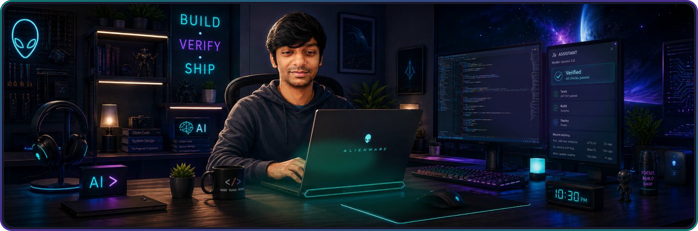
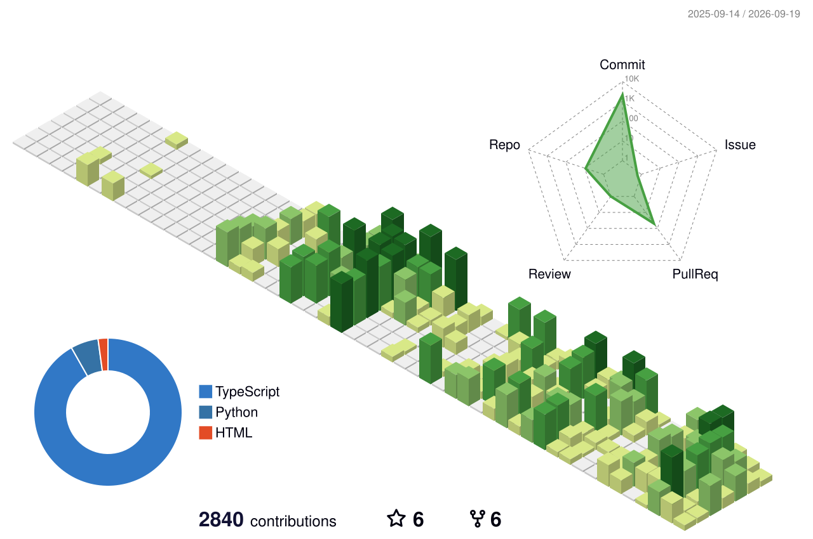

<!-- Hero -->
<div align="center">

<p align="center">
  
</p>



<h1>Aakash Priyadarshi</h1>

<strong>Full-Stack Engineer · AI / RL Researcher</strong>

<br/>


<br/><br/>

<a href="https://aakash-priyadarshi.github.io"></a>
&nbsp;
<a href="mailto:aakashm301@gmail.com"></a>

<br/><br/>

[](https://github.com/aakash-priyadarshi)
[](mailto:aakashm301@gmail.com)
[](https://www.google.com/maps/place/London)

</div>

---

## About

```yaml
name: Aakash Priyadarshi
role: Full-Stack Engineer · AI / RL Researcher
location: London, UK
portfolio: https://aakash-priyadarshi.github.io
focus:
  - Safety-aware AI evaluation & policy gates
  - Long-horizon RL environments for coding agents
  - Production web apps (TypeScript, Python, MERN)
currently_building:
  - ViharaOS
  - Gold Shop platform
  - Frontier agent verification research
ask_me_about: MERN, PyTorch, offline RL, FastAPI, agentic systems
reach_me: aakashm301@gmail.com
```

<table>
<tr>
<td width="50%">

**What I do**

I build full-stack products and research systems where **AI has to be correct, not just confident** — from safety-aware evaluation platforms to long-horizon RL environments for coding agents.

</td>
<td width="50%">

**Highlights**

- Google Scholar profile with published research
- Hackathon-built safety evaluation platform ([SkyGuard AI](https://github.com/aakash-priyadarshi/skyguard-ai-build-week-submission))
- Open-source work across TypeScript, Python, and Flutter
- 50+ public repositories since 2017

</td>
</tr>
</table>

## Featured work

<table>
<tr>
<td width="50%" valign="top">

<a href="https://github.com/aakash-priyadarshi/skyguard-ai-build-week-submission">
  
</a>

### [SkyGuard AI](https://github.com/aakash-priyadarshi/skyguard-ai-build-week-submission)
**Safety-aware training & evaluation for sequential policies & LLMs**

`Python` `PyTorch` `FastAPI` `Next.js` `Offline RL`

Deterministic policy gates, strict verifiers, and simulation-backed evaluation for frontier models.

</td>
<td width="50%" valign="top">

<a href="https://github.com/aakash-priyadarshi/ViharaOS">
  
</a>

### [ViharaOS](https://github.com/aakash-priyadarshi/ViharaOS)
**Platform + desktop experience**

`TypeScript` `HTML`

Web platform with a dedicated desktop client — end-to-end product engineering.

</td>
</tr>
<tr>
<td width="50%" valign="top">

<a href="https://github.com/aakash-priyadarshi/frontier-long-horizon-env-trial">
  
</a>

### [Frontier Long-Horizon Env](https://github.com/aakash-priyadarshi/frontier-long-horizon-env-trial)
**Paired-incident substrate for coding-agent verifier research**

`Python`

Deterministic environments for studying long-horizon agent behavior and verification.

</td>
<td width="50%" valign="top">

<a href="https://github.com/aakash-priyadarshi/Jarvis">
  
</a>

### [Jarvis](https://github.com/aakash-priyadarshi/Jarvis)
**Voice-enabled OpenAI assistant**

`Node.js` `OpenAI` `Speech-to-Text` `Text-to-Speech`

Real-time voice ↔ text interface powered by OpenAI and Google Cloud speech APIs.

</td>
</tr>
</table>

<p align="center">
  <a href="https://github.com/aakash-priyadarshi?tab=repositories"><b>→ See all repositories</b></a>
  &nbsp;·&nbsp;
  <a href="https://aakash-priyadarshi.github.io"><b>→ Full portfolio site</b></a>
</p>

## Tech I reach for

### Frontend

<p>
  
</p>

### Backend

<p>
  
</p>

`REST APIs` `WebSockets` `gRPC`

### AI / ML

<p>
  
</p>

<p>
  
  
  
  
  
  
  
</p>

### Databases / Storage

<p>
  
</p>

<p>
  
  
</p>

### Cloud / DevOps / Infra

<p>
  
</p>

<p>
  
</p>

## Coding time

### This week

<!--START_SECTION:waka-->

```txt
From: 27 August 2026 - To: 03 September 2026

Total Time: 9 hrs 27 mins

TypeScript    3 hrs 33 mins         ████████▓░░░░░░░░░░░░░░░░   34.57 %
Text          3 hrs 33 mins         ████████▓░░░░░░░░░░░░░░░░   34.55 %
Other         51 mins               ██░░░░░░░░░░░░░░░░░░░░░░░   08.26 %
Markdown      37 mins               █▓░░░░░░░░░░░░░░░░░░░░░░░   06.14 %
JavaScript    26 mins               █░░░░░░░░░░░░░░░░░░░░░░░░   04.31 %
Python        14 mins               ▓░░░░░░░░░░░░░░░░░░░░░░░░   02.39 %
JSON          13 mins               ▓░░░░░░░░░░░░░░░░░░░░░░░░   02.14 %
Prisma        11 mins               ▒░░░░░░░░░░░░░░░░░░░░░░░░   01.87 %
YAML          9 mins                ▒░░░░░░░░░░░░░░░░░░░░░░░░   01.52 %
CSS           8 mins                ▒░░░░░░░░░░░░░░░░░░░░░░░░   01.35 %
```

<!--END_SECTION:waka-->

### All time

<!--START_SECTION:wakaall-->
<!--END_SECTION:wakaall-->

## GitHub activity

<div align="center">


<br/><br/>


<br/><br/>


<br/><br/>


</div>

### 3D contribution calendar

<div align="center">



</div>

### Contribution snake

<picture>
  <source media="(prefers-color-scheme: dark)" srcset="./assets/github-contribution-grid-snake-dark.svg" />
  <source media="(prefers-color-scheme: light)" srcset="./assets/github-contribution-grid-snake.svg" />
  
</picture>

---

## Connect

<p align="center">
  <a href="https://linkedin.com/in/aakashpriyadarshi"></a>
  <a href="https://scholar.google.com/citations?user=rJUfOxgAAAAJ&hl=en"></a>
  <a href="https://kaggle.com/aakash-priyadarshi"></a>
  <a href="https://www.hackerrank.com/aakashm301"></a>
  <a href="https://aakash-priyadarshi.github.io"></a>
</p>

---

<div align="center">

**Let's build, verify, and ship something ambitious.**

<br/>

<a href="https://aakash-priyadarshi.github.io"></a>

</div>
